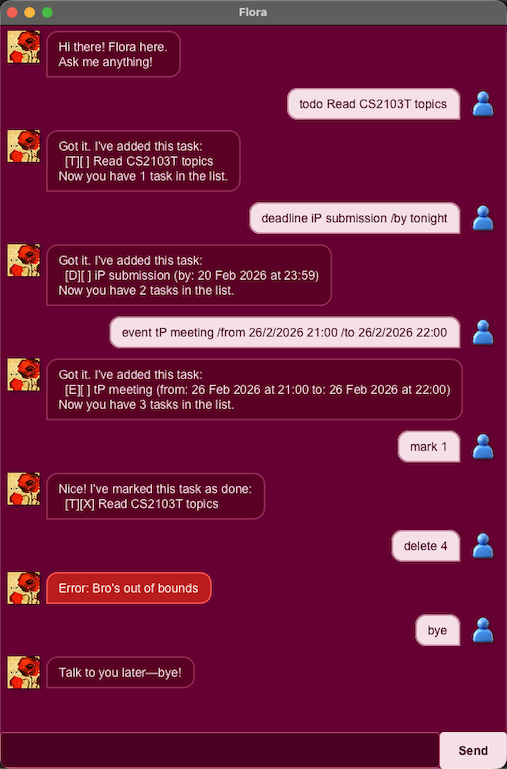

# Flora User Guide

Flora is a desktop chatbot that helps you track your tasks. Type commands into the chat box and Flora will respond.



---

## Task types

| Symbol | Type     | Has dates?              |
|--------|----------|-------------------------|
| `[T]`  | Todo     | No                      |
| `[D]`  | Deadline | Due date                |
| `[E]`  | Event    | Start date and end date |

A `[X]` in the second bracket means the task is done; `[ ]` means it isn't.

---

## Commands

### Add a todo
```
todo <description>
```
```
todo Read textbook
```

---

### Add a deadline
```
deadline <description> /by <date>
```
```
deadline Submit assignment /by 28/2/2026
deadline Submit assignment /by 28/2/2026 23:59
deadline Submit assignment /by tomorrow
```
**Date shortcuts:** `today`, `tonight`, `tomorrow`, `next week`, `next month`
**Date format:** `d/M/yyyy` or `d/M/yyyy H:mm`

---

### Add an event
```
event <description> /from <start> /to <end>
```
```
event Team meeting /from 20/2/2026 14:00 /to 20/2/2026 15:00
```
**Date format:** `d/M/yyyy` or `d/M/yyyy H:mm`

---

### List all tasks
```
list
```

---

### Mark / unmark a task
```
mark <index>
unmark <index>
```
```
mark 2
unmark 2
```

---

### Find tasks
```
find <keyword>
```
```
find assignment
```
Returns all tasks whose description contains the keyword.

---

### Edit a task
```
edit <index> [/desc <new description>] [/by <new due>] [/from <new start>] [/to <new end>]
```
Provide only the fields you want to change. At least one field is required.
```
edit 3 /desc Submit final report
edit 3 /by next week
edit 4 /from 21/2/2026 9:00 /to 21/2/2026 10:00
```
> `/by` applies to deadlines only; `/from` and `/to` apply to events only.

---

### Delete a task
```
delete <index>
```
```
delete 1
```

---

### Exit
```
bye
```

---

## Notes
- Tasks are saved automatically after every command and reloaded when Flora starts.
- Task indexes are based on the order shown by `list`.
